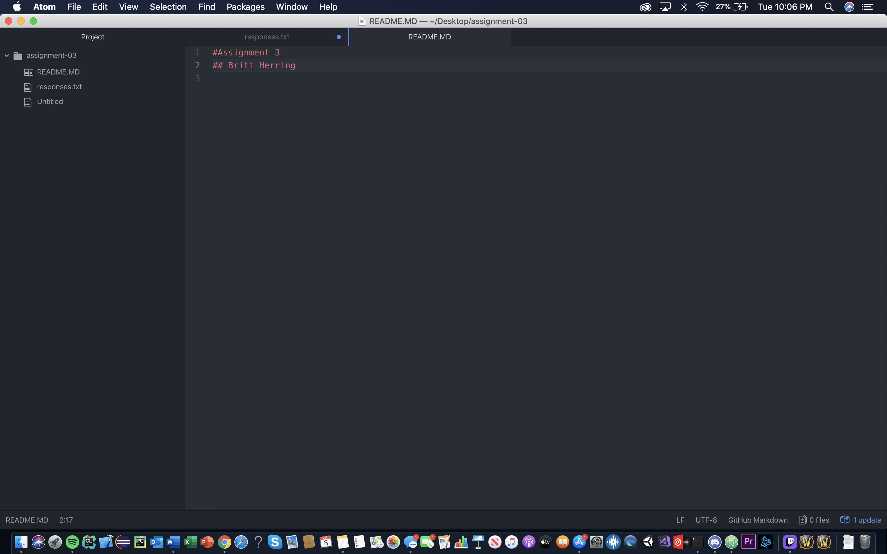

# Assignment 3
## Britt Herring
1. One thing I learned was how internet lines in the ocean are installed via boats and balloons.
2. I had no idea about Markdown so it was nice to work with it and learn how to do links, lists, images, and code
3. I learned that Mimas, a moon of Saturn, has a crater on it that makes it look like the Death Star.

[Google](https://google.com)

[Responses](./responses.txt)

