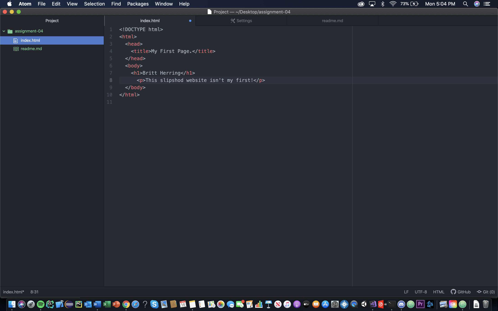

Web browsers are software programs used to access the internet from a device. The primary function of a web browser is to render HTML, the code used to design or "mark up" webpages. Each time a browser loads a web page, it processes the HTML, which may include text, links, and references to images and other items, such as cascading style sheets and JavaScript functions. I currently use Chrome for most applications but when I am forced I use Safari on my mobile devices.

A markup language is a computer language which uses tags to define elements within a document. These include HTML, XML, and XHTML.

