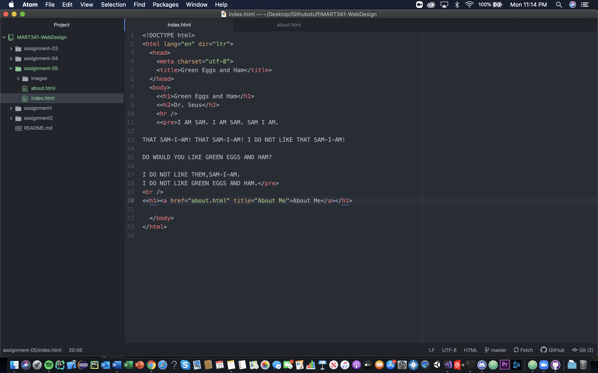

# Assignment 5
## Britt Herring

Using The Wayback Machine I looked at the University of Montana's website because I remember there has been several iterations of it. After glancing around, the previous website to the one they have now seemed the most efficient and streamlined while this current iteration is a bit too complicated.

There were definitely some hurdles to work around during this assignment. First, I was having difficulty with Atom recognizing a Git directory and wouldn't show the folders within WebDesign. I moved the clone to a new folder on my desktop and that fixed the problem. Additionally, I had to spend a bit of time polishing my website as there were mistakes that didn't seem obvious in the code but were glaring when I loaded it up with a web browser. I would say that once I passed the hurdle of setting up Git with Atom the rest was pretty easy.

